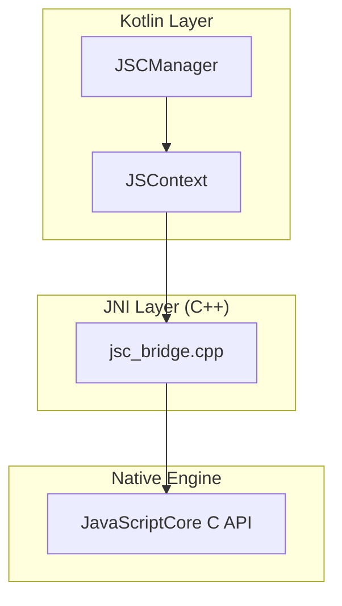

# JSC Bridge

A generic, cross-platform JavaScriptCore bridge for Android (and eventually other platforms).

## Architecture



## Features
- Generic JNI bridge for JavaScriptCore.
- `JSCManager` for managing the JS runtime.
- Support for registering native modules.
- CommonJS module system shim.
- Console logging shim.

## Usage

### Gradle
Add to your `build.gradle`:
```gradle
implementation 'com.clevertree:jscbridge:1.0.0'
```

### Registering a Module
```kotlin
jscManager.addModuleInitializer { context ->
    context.setObjectForKey("__native_func", object : JavaScriptObject() {
        override fun call(arg: String) {
            // Native implementation
        }
    })
}
```

## Architecture
The bridge consists of a C++ layer (`jsc_bridge.cpp`) that talks to the JavaScriptCore C API, and a Kotlin/Java layer that provides a high-level API for Android.

## License
MIT OR Apache-2.0
